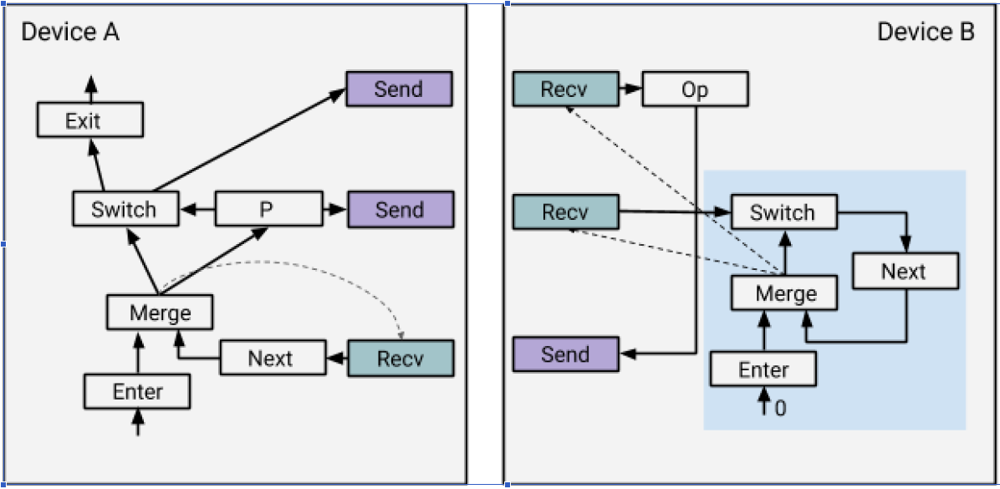

# 读TensorFlow 源码笔记(2): tensorflow的控制流算子(control_flow_op)

- 介绍专门为处理控制流而添加的五个TensorFlow原语运算符,
- 演示如何将高级控制流结构编译为包含这五个原语的数据流图

- 解释TensorFlow运行时如何执行这些数据流图，包括在一组混合设备（如CPU、GPU和TPU）上的分布式执行，并描述自动区分对控制流结构的作用。

## 控制流原语
在TensorFlow中，控制流的基本设计原则中引入一组非常小的简单、原始的运算符，这些运算符广泛应用在TensorFlow的复杂控制流中。我们希望这些原语具有灵活性和表现力，成为高级领域特定语言（DSL）的良好编译目标。它们应该很好地适应TensorFlow的数据流模型，并且应该能够并行和分布式执行以及自动区分。

有五个控制流原语运算符，如下所示。它们与Dennis和Arvind开发的数据流机器中引入的控制流原语非常相似。Switch和Merge的结合允许我们实现条件语句。所有五个原语一起允许我们实现while循环。


在TensorFlow中，每个操作都在一个执行帧(execution frame)中执行，控制流原语负责创建和管理这些执行帧(execution frame)。直观地说，对于每个while循环，TensorFlow运行时设置一个执行帧(execution frame)，并在执行帧(execution frame)内运行属于while循环的所有操作(op)。执行帧(execution frame)可以嵌套。嵌套的while循环在嵌套的执行帧(execution frame)中运行。来自不同执行帧(execution frame)的操作(op)可以并行运行，只要它们之间没有数据依赖关系。

**Switch :** *switch*算子根据控制输入`p`的布尔张量(tensor of bool)将输入张量`d`(input tensor)转发到其输出之一。当*switch*的两个输入`p`和`d`都可用时，*switch*被启用以执行。

**Merge :** *merge*运算符将其一个可用输入转发到其输出。当*merge*的任何输入可用时，将启用该*merge*以执行。如果有多个可用输入，则不指定输出哪个可用输入。

**Enter(name) :** *Enter*运算符将其输入转发到由给定名称(name)唯一标识的执行帧(execution frame)。此Enter op用于将一个执行帧(execution frame)中的张量传递给子执行帧。同一子执行帧可以有多个*Enter*操作，每个*Enter*操作都使该子执行帧中的张量可用（异步）。当输入可用时，将启用*Enter*执行。当对该帧执行第一个*Enter*操作时，将在TensorFlow运行时实例化一个新的执行帧。

**Exit :** *Exit*运算符将值从执行帧转发到其父执行帧。此*Exit* op用于将子执行帧中计算的张量返回到其父帧。父帧可以有多个退出操作，每个都异步地将张量传递回父帧。退出在其输入可用时启用。

**NextIteration :** *NextIteration*运算符将其输入转发到当前执行帧中的下一个迭代。TensorFlow运行时在执行帧中跟踪迭代。在执行帧中执行的任何操作都有一个唯一的迭代id，它允许我们在迭代计算中唯一地标识同一操作的不同调用。注意，在一个执行帧中可以有多个NextIteration操作。TensorFlow运行时在迭代N执行第一个NextIteration操作时启动迭代N+1。随着更多的Tensor通过执行NextIteration操作进入迭代，该迭代中的更多操作将准备好执行。当输入可用时，将启用NextIteration。

## 控制流结构的编译
 通过添加以上这五个控制流原语，条件(cond)和循环(while_)等高级编程结构现在就可以编译成数据流图，这些数据流图可以由TensorFlow运行时执行。

 ### 条件(cond)运算符
 下面是构建cond(pred，fn1，fn2)数据流图的高级伪代码。为了简单起见，此中忽略了实际实现中的许多重要问题。读者可以在control_flow_ops.py中找到实现。
 ```python 
 # Build the graph for the true branch
context_t = CondContext(pred, branch=1)
res_t = context_t.Call(fn1)
# Build the graph for the false branch
context_f = CondContext(pred, branch=0)
res_f = context_f.Call(fn2)
# Add the Merge nodes for the outputs
merges = [Merge([f, t]) for (f, t) in zip(res_f, res_t)]
return merges
 ```

 对于cond的每个分支，我们为条件语句创建一个新的控制流上下文，并在上下文中调用其图形构造函数（fn1或fn2）。条件上下文允许捕获任何外部张量（不是在上下文中创建的）并插入适当的Switch op来保护其进入分支(branch)。这确保了分支中的任何操作都只能在执行该分支时执行。由于TensorFlow的异步执行模型，这些外部张量可能在非常不同的时间变得可用，因此还需要为每个外部张量使用一个switch操作以最大限度地提高并行性。

 每个分支返回一个张量列表作为结果（ref_t或res_f）；然后添加一个合并节点列表，分别合并(merge)每个输出的true和false值。同样，输出可以在非常不同的时间进行计算，因此我们对每个输出使用一个合并(merge)操作，这允许能够尽快启用下游计算。

 作为一个例子，看看这个简单的程序。
 

 ```python 
 tf.cond(x < y, lambda : tf.add(x, z), lambda : tf.square(y))
 ```
 在生成的数据流图中，在true/false分支上插入开关(switch)操作以控制张量x、y 和z 的流。由于add的输入来自switch ops的true输出，因此仅当x < y 为真时才执行add op。类似地，Square op仅在x < y 为false时执行。最后的Merge op发出Add或Square的结果。如果有多个输出，将有多个merge操作，每个输出一个结果。

 有多种方法可以使用Switch和Merge对cond进行编码。这里的编码主要是因为它使cond的自动区分变得更简单。

### while_循环运算符
下面是构建while_循环(pred，body，loop_vars)数据流图的高级伪代码：
```python
while_context = WhileContext()
while_context.Enter()
# Add the Enter nodes for each loop variable.
enter_vars = [Enter(x, frame_name) for x in loop_vars]
# Add the Merge nodes. Note that input[1] will be updated later.
merge_vars = [Merge([x, x]) for x in enter_vars]
# Build the loop pred subgraph.
pred_result = pred(*merge_vars)
# Add the Switch nodes.
switch_vars = [Switch(x, pred_result) for x in merge_vars]
# Build the loop body subgraph.
body_result = body(*[x[1] for x in switch_vars])
# Add the NextIteration nodes.
next_vars = [NextIteration(x) for x in body_result]
# Form the cycles for the loop.
for m, v in zip(merge_vars, next_vars):
m.op._update_input(1, v)
# Add the Exit nodes.
exit_vars = [Exit(x[0]) for x in switch_vars]
while_context.Exit()
return exit_vars
```

整个while循环图是在while循环的控制流上下文中创建的。这里的基本思想很简单。
从循环变量开始，我们为每个变量添加一个*Enter*操作，然后添加一个*Merge*操作。然后使用结果（merge_vars）构建pred子图，该子图计算循环终止条件。

在添加开关(switch)操作之后，我们使用*switch*的true输出为*while*循环的主体构建子图。循环体的结果需要进入下一个迭代，因此我们添加*next iteration*操作并将它们连接回*Merge*操作的第二个输入。这形成了循环，允许我们在执行图时多次重复运行同一个操作。

开关(switch)操作的false输出是整个while循环的输出，因此我们将*exit*操作添加到它们并返回*exit*操作的输出。与*cond*类似，*while*循环上下文用于跟踪*pred*和*body lambdas*中使用的外部张量。这些外部张量被视为循环常量，自动为每个这样的外部张量插入一个*Enter op*，使其在*while*循环上下文中可访问。嵌套循环需要添加嵌套的*Enter ops*。

为一个简单程序生成的图.


```python
tf.while_loop(lambda i : i< 10, lambda i : tf.add(i,1),[0])
```
对于这个例子，只有一个循环变量。如果有多个循环变量，我们将有多个Enter、Merge、Switch、NextIteration和Exit操作。这使得可以跨多个循环和循环内的多个迭代执行并行。

cond和while_循环的这种转换支持条件句和循环的任意嵌套。例如，循环体可以调用另一个while_循环，该循环将递归地转换为嵌套子图。转换确保每个循环静态地分配一个唯一的帧名(frame name)。

## 实现
要在多个设备上运行，TensorFlow会自动将操作(op)分配给设备集(device set)。根据设备的位置，TensorFlow自动将数据流图划分为一组子图(subgraph)，每个设备分配一个子图(subgraph)。当一条边被分区(partition)破坏时，会自动插入一对发送(send)和接收(recv)节点，用于跨设备传输张量(tensor)。一对send和recv使用一个唯一的密钥(key)进行通信，recv主动从send中拉去数据。例如，下面是将一个图分区到两个设备上的结果。TensorFlow对分区没有任何限制：只要可以在设备上进行计算，就可以将节点分配给该设备。


子图的执行由子图分配给的设备的本地执行器(executor)管理。执行器(executor)从源节点(source node)开始并重复执行就绪节点(ready
nodes)。当一个节点的所有输入都可用时，该节点(合并节点(merge node)除外)将准备就绪。注意，子图中的所有recv节点都被视为源节点(source node)。
在没有控制流的情况下，图的执行在概念上是非常简单的：每个节点只执行一次，执行是在所有节点都执行时完成的。控制流引入了相当多的复杂性。一个节点现在可以执行任意次数，包括0。执行器需要能够管理同一节点的多个实例（可能并发）的执行，并确定图形执行的完成。

为了跟踪执行期间生成的张量，执行器中的张量表示为一个元组d=(value，is_dead，tag)，其中value是实际的张量，is_dead是一个布尔值，指示张量是否在条件的未指定分支上，tag是唯一标识张量(以及生成张量的节点的执行实例)的字符串。直观地说，tag定义了一个执行上下文(executor context)，在一个执行上下文中，节点最多执行一次。tag是send/recv对的通信密钥(key)的一部分，用于区分同一send/recv对的多个调用。
执行器遵循以下执行规则（注意：节点的所有输入必须具有相同的标记(tag)）:
- Switch(p, d) = (r<sub>1</sub>, r<sub>2</sub> ) :

  r<sub>1</sub> = (value(d), p || is_dead(d), tag(d))

  r<sub>2</sub> = (value(d), !p || is_dead(d), tag(d))

- Merge(d<sub>1</sub> , d<sub>2</sub> ) = r :

  r = if is_dead(d<sub>1</sub> ) then d<sub>2</sub> else d<sub>1</sub>

-  Enter(d, frame_name) = r :

    value(r) = value(d)

    is_dead(r) = is_dead(d)

    tag(r) = tag(d)/frame_name/0

- Exit(d) = r :

  value(r) = value(d)

  is_dead(r) = is_dead(d)

  tag(r) = tag<sub>1</sub> where tag(d) = tag<sub>1</sub> /frame_name/n

- NextIteration(d) = d<sub>1</sub>:

  value(d<sub>1</sub> ) = value(d)

  is_dead(<sub>1</sub> ) = is_dead(d)

  tag(<sub>1</sub> ) = tag<sub>1</sub> /frame_name/(n+1) where tag(d) = tag<sub>1</sub> /frame_name/n

- Op(d<sub>1</sub> , …, d<sub>m</sub> ) = (r<sub>1</sub> , …, r<sub>n</sub> ) :

  value(r<sub>i</sub> ) = Op.Compute(value(d<sub>1</sub> ), …, value(d<sub>m</sub>)) if !is_dead(r<sub>i</sub>)

  is_dead(r<sub>i</sub> ) = any(is_dead(d<sub>1</sub> ), … is_dead(d<sub>m</sub> )), for all i

  tag(r<sub>i</sub> ) = tag(d<sub>1</sub> ), for all i

  最后一条规则适用于所有非控制流节点。请注意，实际计算仅在所有输入都未停止时执行。如果存在死区输入，我们将跳过计算并在下游传播死区信号。这种死区传播用于支持控制流的分布式执行。

  ## 分布式条件执行
  对于分布式执行，可以将cond分区到多个设备上，如下所示。
  

  ~~~<font size=4>由于任何recv节点都是源节点，并且可以无条件地启动，因此即使设备B上的recv位于cond的untaken分支上，它也可以启动。为了使untaken分支上的recv高兴，我们在从send到recv的设备之间传播is_dead标志。传播可以在任意数量的设备上继续。这个简单的传播方案处理嵌套条件的分布式执行，并与while循环的分布式执行进行良好的交互。 没看懂！！！！！！！！！！！！！！！</font>~~~
## 分布式While循环
对于分布式执行，一个while循环，特别是循环体，可以被划分到多个设备上。如果纯粹地应用跨设备边添加send/recv节点的分区方案，设备上的本地执行器将没有足够的信息来正确运行while循环。 


让我们用一个简单的例子来说明这些问题。在上面的例子中，Op在循环体中，并被分配给设备B。一个简单的分区只需要使用一对send/recv节点就可以将边缘从Switch断开到Op。但是，这将不起作用，因为设备B不知道recv和Op节点是while循环的一部分，并且将在一次迭代后终止执行。解决方案是重写数据流图，在每个分区中添加一个控制循环状态机（如下设备B的右下角所示）。标量张量0用作控制循环的输入节点。
