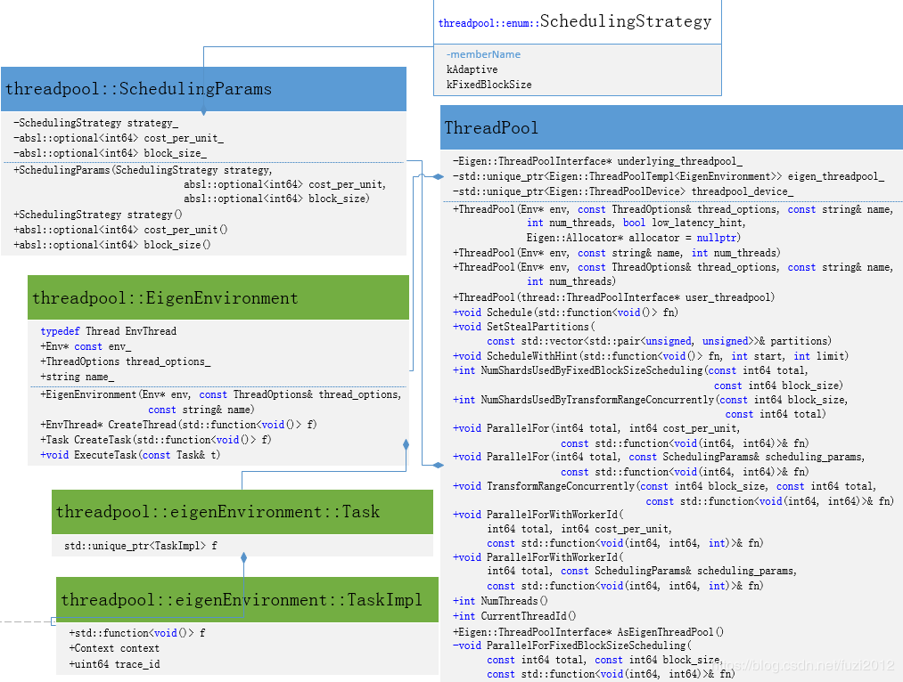

# 读TensorFlow 源码笔记(1): tensorflow的多线程机制eigen::threadpool
线程池的概念大家都知道，就是事先创建固定数量或者不困定数量的线程，计算并行任务是直接调用线程池里的线程，从而减少了线程的频繁创建与销毁等动作对资源的消耗。
TensorFlow 是高效的深度学习计算框架，以计算子`operator`为单位进行调度，底层依赖于第三方数学库eigen，算子间与算子内都可以都可以进行并行计算。在`ConfigProto` 文件中有定义`inter_/intra_op_parallelism_threads`,其中`inter_op_parallelism_threads`表示算子间并行计算线程数；其中`intra_op_parallelism_threads`表示算子内并行计算线程数，如`CONV`算子等。
TensorFlow的线程池直接封装Eigen 的`threadpool`,菜鸟今天从eigen到TensorFlow源码一层层细细品味`eigen::threadpool` 机制源码。
## 1.tensorflow 与eigen 的threadpool 界面
先看看在TensorFlow中的threadpool 类图架构：



在TensorFlow源码`tensorflow/core/platform/threadpool.h`文件中230-237行：
```cpp
  // underlying_threadpool_ is the user_threadpool if user_threadpool is
  // provided in the constructor. Otherwise it is the eigen_threadpool_.
  Eigen::ThreadPoolInterface* underlying_threadpool_;
  // eigen_threadpool_ is instantiated and owned by thread::ThreadPool if
  // user_threadpool is not in the constructor.
  std::unique_ptr<Eigen::ThreadPoolTempl<EigenEnvironment>> eigen_threadpool_;
  std::unique_ptr<Eigen::ThreadPoolDevice> threadpool_device_;
  TF_DISALLOW_COPY_AND_ASSIGN(ThreadPool);
```
从以上类图跟代码中都能看到 TensorFlow里面直接封装了`Eigen::ThreadPoolInterface`、`Eigen::ThreadPoolTempl`、`Eigen::ThreadPoolDevice`。
- `Eigen::ThreadPoolInterface`：提供一个eigen线程池的接口，供用户自定义线程池。
- `Eigen::ThreadPoolTempl` ： 提供一个eigen的线程池实现，TensorFlow中的线程池多用了这个实现。
- `Eigen::ThreadPoolDevice` ：这个结构体在eigen中`./unsupported/Eigen/CXX11/src/Tensor/TensorReduction.h`找到，表示能够使用线程池的设备，这里指的是CPU。
在eigen 源码中也没有找到 `Eigen::ThreadPoolTempl` 这个类的定义，我们在eigen源码目录下执行：
```shell
 grep 'ThreadPoolTempl' -R ./
```
能找到一下两行内容：
```
./unsupported/Eigen/CXX11/ThreadPool:template <typename Env> using ThreadPoolTempl = NonBlockingThreadPoolTempl<Env>;
./unsupported/Eigen/CXX11/ThreadPool:template <typename Env> using ThreadPoolTempl = SimpleThreadPoolTempl<Env>;

```
也就是`ThreadPoolTempl`是`NonBlockingThreadPoolTempl<Env>` 和 ` SimpleThreadPoolTempl<Env>` 一个选择，具体定义在接口文件`./unsupported/Eigen/CXX11/ThreadPool`中：
```proro
// Use the more efficient NonBlockingThreadPool by default.
namespace Eigen {
#ifndef EIGEN_USE_SIMPLE_THREAD_POOL
template <typename Env> using ThreadPoolTempl = NonBlockingThreadPoolTempl<Env>;
typedef NonBlockingThreadPool ThreadPool;
#else
template <typename Env> using ThreadPoolTempl = SimpleThreadPoolTempl<Env>;
typedef SimpleThreadPool ThreadPool;
#endif
}  // namespace Eigen
```
## 2 eigen 中的threadpool
从上面的描述中可以知道，在Eigen库中，有两种线程管理方式，即`NonBlockThreadPool`和`SimpleThreadPool`，在默认情况下TensorFlow使用`NonBlockThreadPool`。为了简单起见，这里仅从比较简洁明了的SimpleThreadPool简单线程管理机制阐述相应的内容，它定义在SimpleThreadPool.h文件中。先看一下源码的类图：

我们首先分析它的构造函数。
```cpp
 // Construct a pool that contains "num_threads" threads.
  explicit SimpleThreadPoolTempl(int num_threads, Environment env = Environment())
      : env_(env), threads_(num_threads), waiters_(num_threads) {
    for (int i = 0; i < num_threads; i++) {
      threads_.push_back(env.CreateThread([this, i]() { WorkerLoop(i); }));
    }
  }
```
构造函数有两个参数：

 - num_threads用来指定线程池中线程的个数；
- Environment类在此处是一个模板类，是一个运行环境的接口，里面要实现`EnvThread* CreateThread(std::function<void()> f)` 方法和`Task CreateTask(std::function<void()> f)` 方法。目前Eigen有一相应的实现类`StlThreadEnvironment`类封装了一些与线程相关的操作，而这些操作都是调用了C++的标准库，但是这样实现，其实也是为了以后扩展和移植方便。事实上，在TensorFlow中也有Environment类，其中定义了一些与操作系统、文件系统、线程等相关的方法。

构造函数主要在完成一些初始化操作，对应上边的类图看：
包括初始化Environment对象env_，初始化线程数`num_threads`并且创建线程并保存在线程数组`threads_`中，以及初始化`waiters_`数组。需要说明的是，waiters_数组是用于存放线程池中那些空闲线程，这就是它长度与线程个数相同的原因。结构体：
```cpp
struct Waiter {
    std::condition_variable cv;  //信号条件变量，作为挂起线程与激活激活线程的信号量
    Task task;                   // 需要被线程调度的任务(封装可执行的函数)
    bool ready;                  // 线程是否繁忙的标志
  };
```

在类图中可以看到，除了上面提及的三个成员变量外，`SimpleThreadPool`还有一个重要的成员叫做`pending_`，定义如下。
```cpp
std::deque<Task> pending_;  
```
`pending_`是一个双向队列，它用来保存那些等待被线程领取的任务。`pending_`队列元素类型是`Task`类，它是一个函数对象的封装，见ThreadEnvironment.h。
```cpp
struct Task {
    std::function<void()> f;
  };
```

SimpleThreadPool的工作流程大致如下。当一个任务（Task）过来时，会首先从waiters_数组中查看有没有空闲的线程。如果有，那么从waiters_数组中拿一个线程出来，并把该任务分配给线程处理，并激活该线程干活。如果waiters_数组为空，说明所有线程都忙碌，此时会将Task放到pending_队列中。上面的逻辑定义在`SimpleThreadPool.h`文件的Schedule函数中。
```cpp
void Schedule(std::function<void()> fn) final {
    Task t = env_.CreateTask(std::move(fn)); // 创建一个Task类的对象
    std::unique_lock<std::mutex> l(mu_);
    if (waiters_.empty()) {                  //判断是否有空闲线程
      pending_.push_back(std::move(t));      // 若没有空闲线程，放进队列里等待
    } else {                                 //若有空闲进程
      Waiter* w = waiters_.back();          //在队列中取出该waiter对象
      waiters_.pop_back();  
      w->ready = true;                     // 设置可执行标志 
      w->task = std::move(t);              //分配任务  
      w->cv.notify_one();                  //激活线程去干活
    }
  }
```
从上面的代码我们还可以猜到，waiters_数组实现了一个栈，采用的是后进先出策略，在线程池中充当一个监工的角色。那些人没活儿干，我给你记着；等活儿来了，我给你分配，并叫你去干活。

线程的关键逻辑：
在构建函数里就看到，在初始化创建线程时就开始执行一个`WorkerLoop(i)`函数，
```cpp
threads_.push_back(env.CreateThread([this, i]() { WorkerLoop(i); }));
```
比作一个员工，每个线程的工作逻辑是`WorkerLoop`函数定义的，在`SimpleThreadPool.h`文件中。
```cpp
void WorkerLoop(int thread_id) {
    std::unique_lock<std::mutex> l(mu_);
    PerThread* pt = GetPerThread();
    pt->pool = this;
    pt->thread_id = thread_id;    // 定义自己的ID ，也就是该员工的工号
    Waiter w;   
    Task t;
    while (!exiting_) {          // 没有被叫停
      if (pending_.empty()) {     //   如果队列为空 
        // Wait for work to be assigned to me
        w.ready = false;         //
        waiters_.push_back(&w);  // 把该空闲线程队列中等待被唤醒
        while (!w.ready) {
          w.cv.wait(l);          //
        }
        t = w.task;
        w.task.f = nullptr;
      } else {                 // 等待队列中有任务
        // Pick up pending work
        t = std::move(pending_.front());   //取出任务
        pending_.pop_front();    
        if (pending_.empty()) {
          empty_.notify_all();    //通知等待队列有空位，可以插值
        }
      }
      if (t.f) {
        mu_.unlock();
        env_.ExecuteTask(t);    //执行任务
        t.f = nullptr;
        mu_.lock();
      }
    }
  }
```


线程池的大体流程如下：

